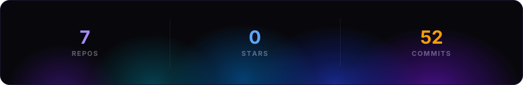
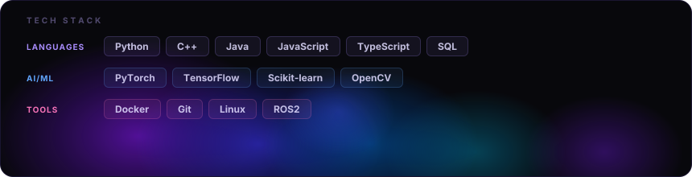

***

## 🚀 Featured Projects

* **Neuro-Symbolic Visual Reasoning (NSVR)**: A reasoning pipeline combining deep visual perception with symbolic reasoning for Explainable AI in medical imaging. Built with *PyTorch & CLEVR*.
* **NeuroViz (AI Command Center)**: Real-time AutoML monitoring dashboard with a custom neural architecture visualizer built purely in Canvas API & Vanilla JS.
* **Fetchmate (Autonomous Mapping Robot)**: Indoor robot mapping and object detection using Hector SLAM, ROS2, MQTT, and LiDAR on Raspberry Pi. *(Published in 2025 SISCON IEEE Xplore)*
* **Gamified Rehabilitation System**: Wearable AI-powered therapy system using IMUs, Unity, and MediaPipe for physical impairment recovery. *(Patent Pending)*

## 📚 Publications & Achievements

* **IEEE Publication**: Published research on Autonomous Indoor Mapping (Fetchmate) and presented papers on Neuro-Symbolic ASR and EV Energy Management.
* **Patent Pending**: Filed a patent for an AI-powered gamified rehabilitation system.
* **Leadership**: Founder/Core Team Member of IEEE Computer Society Student Branch Chapter at Amrita Vishwa Vidyapeetham.

## 🛠️ Skills & Technologies

* **Languages**: Python, C++, Java, JavaScript, TypeScript, SQL
* **AI/ML**: PyTorch, TensorFlow, Keras, Scikit-learn, OpenCV
* **Backend & Data**: FastAPI, Flask, Django, Node.js, PostgreSQL, MongoDB, Kafka, Spark
* **Tools & Platforms**: Docker, Git, Linux, ROS2, Raspberry Pi, Arduino

***

𝗉𝗈𝗐𝖾𝗋𝖾𝖽 𝖻𝗒 <a href="https://github.com/collectioneur/readme-aura">𝗋𝖾𝖺𝖽𝗆𝖾-𝖺𝗎𝗋𝖺</a>

