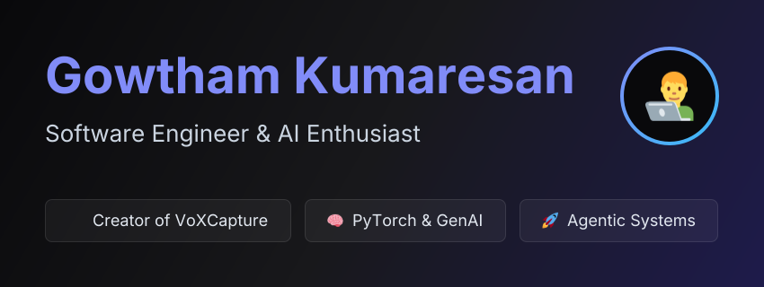

 

  
  

***

### 👨‍💻 About Me

* 💼 I’m currently looking for new opportunities as a **Software Engineer / AI Developer**.
* 🔭 I recently built **VoXCapture**, a real-time voice-fingerprint capture and voice-changer tool.
* 🌱 I’m currently deepening my knowledge in **Machine Learning, LLMs, and System Architecture**.
* 💬 Ask me about **Python, Backend Development, or Audio Processing**.

***

### 🛠️ Tech Stack & Tools

  

***

### 📊 GitHub Stats

  
  

 

  

